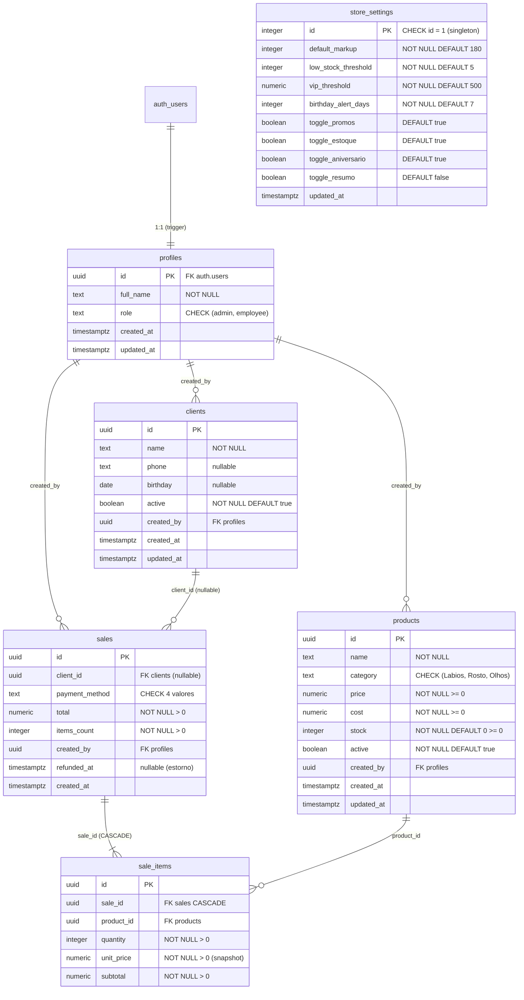

# Data Architecture: CRM Studio Belle — Fase 2

## Diagrama de Entidades (Mermaid)



---

## Tabelas

### profiles

Extensao de `auth.users`. Criada automaticamente via trigger `on_auth_user_created` quando um usuario e inserido pelo Supabase Auth. Nunca inserida diretamente pelo frontend.

| Coluna | Tipo | Restricoes | Descricao |
|--------|------|------------|-----------|
| id | uuid | PK, FK auth.users ON DELETE CASCADE | Mesmo ID do auth.users |
| full_name | text | NOT NULL | Nome completo do usuario |
| role | text | NOT NULL DEFAULT 'employee', CHECK (role IN ('admin', 'employee')) | Role do usuario |
| created_at | timestamptz | NOT NULL DEFAULT now() | Data de criacao |
| updated_at | timestamptz | NOT NULL DEFAULT now() | Ultima atualizacao |

### products

Catalogo de produtos do salao. Soft delete via coluna `active` (nunca DELETE real). A coluna `cost` e confidencial — visivel apenas para admin via view `products_display`.

| Coluna | Tipo | Restricoes | Descricao |
|--------|------|------------|-----------|
| id | uuid | PK DEFAULT gen_random_uuid() | Identificador unico |
| name | text | NOT NULL | Nome do produto |
| category | text | NOT NULL, CHECK (category IN ('Labios', 'Rosto', 'Olhos')) | Categoria (acentos preservados) |
| price | numeric(10,2) | NOT NULL, CHECK (price >= 0) | Preco de venda |
| cost | numeric(10,2) | NOT NULL, CHECK (cost >= 0) | Custo de aquisicao (confidencial) |
| stock | integer | NOT NULL DEFAULT 0, CHECK (stock >= 0) | Quantidade em estoque |
| active | boolean | NOT NULL DEFAULT true | Soft delete (false = excluido) |
| created_by | uuid | FK profiles ON DELETE SET NULL | Quem cadastrou |
| created_at | timestamptz | NOT NULL DEFAULT now() | Data de criacao |
| updated_at | timestamptz | NOT NULL DEFAULT now() | Ultima atualizacao |

### clients

Clientes da loja. Soft delete via `active`. Campos derivados (total_spent, last_purchase, tags VIP/ANIVERSARIO) NAO sao armazenados — calculados via query.

| Coluna | Tipo | Restricoes | Descricao |
|--------|------|------------|-----------|
| id | uuid | PK DEFAULT gen_random_uuid() | Identificador unico |
| name | text | NOT NULL | Nome completo |
| phone | text | nullable | Telefone/WhatsApp |
| birthday | date | nullable | Data de aniversario (para tag ANIVERSARIO) |
| active | boolean | NOT NULL DEFAULT true | Soft delete |
| created_by | uuid | FK profiles ON DELETE SET NULL | Quem cadastrou |
| created_at | timestamptz | NOT NULL DEFAULT now() | Data de criacao |
| updated_at | timestamptz | NOT NULL DEFAULT now() | Ultima atualizacao |

### sales

Registro de vendas. Imutavel apos criacao — sem UPDATE/DELETE. Estorno marcado via `refunded_at` (RPC admin-only). `total` e `items_count` sao snapshots calculados no momento da venda pela RPC `create_sale`.

| Coluna | Tipo | Restricoes | Descricao |
|--------|------|------------|-----------|
| id | uuid | PK DEFAULT gen_random_uuid() | Identificador unico |
| client_id | uuid | nullable, FK clients | Cliente da venda (NULL = venda avulsa "Consumidor final") |
| payment_method | text | NOT NULL, CHECK (payment_method IN ('Pix', 'Cartao de credito', 'Cartao de debito', 'Dinheiro')) | Forma de pagamento |
| total | numeric(10,2) | NOT NULL, CHECK (total > 0) | Valor total (snapshot) |
| items_count | integer | NOT NULL, CHECK (items_count > 0) | Quantidade total de itens (snapshot = SUM(quantity)) |
| created_by | uuid | FK profiles ON DELETE SET NULL | Quem registrou a venda |
| refunded_at | timestamptz | nullable | Timestamp do estorno (NULL = venda ativa) |
| created_at | timestamptz | NOT NULL DEFAULT now() | Data/hora da venda |

**Decisao — `total` e `items_count` como snapshot:** Embora possam ser derivados de `sale_items`, armazenamos por: (1) performance — evita JOIN em queries frequentes como "vendas de hoje"; (2) integridade historica — se um produto for editado, o valor da venda nao muda.

**Decisao — `client_id` nullable:** Vendas avulsas sem cliente vinculado ("Consumidor final") sao representadas com `client_id = NULL`. Alternativa descartada: criar registro especial "Consumidor final" na tabela clients — adicionaria complexidade sem beneficio e poluiria metricas de clientes.

**Decisao — `payment_method` com acentos:** Os valores incluem caracteres acentuados para exibicao direta na UI sem mapeamento. O CHECK constraint usa os mesmos valores que a UI: 'Pix', 'Cartao de credito', 'Cartao de debito', 'Dinheiro'.

### sale_items

Itens individuais de uma venda. Imutavel — criado junto com a venda, nunca atualizado. DELETE apenas em cascata com a venda pai. `unit_price` e snapshot do preco no momento da venda.

| Coluna | Tipo | Restricoes | Descricao |
|--------|------|------------|-----------|
| id | uuid | PK DEFAULT gen_random_uuid() | Identificador unico |
| sale_id | uuid | NOT NULL, FK sales ON DELETE CASCADE | Venda pai |
| product_id | uuid | NOT NULL, FK products | Produto vendido |
| quantity | integer | NOT NULL, CHECK (quantity > 0) | Quantidade vendida |
| unit_price | numeric(10,2) | NOT NULL, CHECK (unit_price > 0) | Preco unitario no momento da venda (snapshot) |
| subtotal | numeric(10,2) | NOT NULL, CHECK (subtotal > 0) | quantity * unit_price |

### store_settings

Configuracoes da loja. Tabela singleton (uma unica linha garantida por CHECK id = 1). Criada no seed, nunca inserida nem deletada pelo frontend.

| Coluna | Tipo | Restricoes | Descricao |
|--------|------|------------|-----------|
| id | integer | PK DEFAULT 1, CHECK (id = 1) | Garante linha unica |
| default_markup | integer | NOT NULL DEFAULT 180, CHECK (default_markup BETWEEN 0 AND 500) | Markup padrao (%) |
| low_stock_threshold | integer | NOT NULL DEFAULT 5, CHECK (low_stock_threshold >= 0) | Limiar de estoque baixo |
| vip_threshold | numeric(10,2) | NOT NULL DEFAULT 500.00 | Total gasto para tag VIP |
| birthday_alert_days | integer | NOT NULL DEFAULT 7, CHECK (birthday_alert_days >= 0) | Dias antes do aniversario para gerar alerta |
| toggle_promos | boolean | NOT NULL DEFAULT true | Notificacao de promocoes |
| toggle_estoque | boolean | NOT NULL DEFAULT true | Alerta de estoque baixo |
| toggle_aniversario | boolean | NOT NULL DEFAULT true | Alerta de aniversario |
| toggle_resumo | boolean | NOT NULL DEFAULT false | Resumo diario por email |
| updated_at | timestamptz | NOT NULL DEFAULT now() | Ultima atualizacao |

---

## DDL SQL Completo

Ordem de execucao: extensions, function generica, helper functions, tabelas (com RLS + indices + triggers), Auth Hook, trigger handle_new_user, view products_display, RPCs.

```sql
-- ============================================================
-- CRM Studio Belle — Fase 2: Migration Completa
-- ============================================================
-- Ordem:
--   1. Function generica (fn_update_timestamp)
--   2. Helper functions (requesting_user_id, get_user_role, is_admin)
--   3. Tabelas + RLS + indices + triggers updated_at
--   4. Auth Hook (custom_access_token_hook) + grants
--   5. Trigger handle_new_user
--   6. View products_display
--   7. RPCs (create_sale, soft_delete_product, soft_delete_client, cancel_sale)
--   8. Trigger de validacao e decremento de estoque
-- ============================================================


-- ============================================================
-- 1. FUNCTION GENERICA
-- ============================================================

CREATE OR REPLACE FUNCTION fn_update_timestamp()
RETURNS trigger
LANGUAGE plpgsql
AS $$
BEGIN
  NEW.updated_at = now();
  RETURN NEW;
END;
$$;


-- ============================================================
-- 2. HELPER FUNCTIONS PARA RLS
-- ============================================================

-- Wrapper para auth.uid() — cacheia no query plan (padrao cross-project validado)
CREATE OR REPLACE FUNCTION requesting_user_id()
RETURNS uuid
LANGUAGE sql
STABLE
AS $$
  SELECT (SELECT auth.uid());
$$;

-- Leitor de role do JWT — sem subquery em cada policy
CREATE OR REPLACE FUNCTION get_user_role()
RETURNS text
LANGUAGE sql
STABLE
SECURITY DEFINER
SET search_path = public
AS $$
  SELECT COALESCE(
    ((SELECT auth.jwt()) -> 'app_metadata' ->> 'role'),
    'employee'
  );
$$;

-- Verificacao booleana direta
CREATE OR REPLACE FUNCTION is_admin()
RETURNS boolean
LANGUAGE sql
STABLE
SECURITY DEFINER
SET search_path = public
AS $$
  SELECT get_user_role() = 'admin';
$$;


-- ============================================================
-- 3. TABELAS + RLS + INDICES + TRIGGERS
-- ============================================================


-- -------------------------------------------------------
-- 3.1 profiles
-- -------------------------------------------------------

CREATE TABLE profiles (
  id         uuid REFERENCES auth.users(id) ON DELETE CASCADE PRIMARY KEY,
  full_name  text NOT NULL,
  role       text NOT NULL DEFAULT 'employee'
               CHECK (role IN ('admin', 'employee')),
  created_at timestamptz NOT NULL DEFAULT now(),
  updated_at timestamptz NOT NULL DEFAULT now()
);

ALTER TABLE profiles ENABLE ROW LEVEL SECURITY;

-- SELECT: admin ve todos; employee ve apenas o proprio
CREATE POLICY "profiles_select" ON profiles
  FOR SELECT USING (
    requesting_user_id() = id OR is_admin()
  );

-- UPDATE: apenas admin pode alterar profiles
CREATE POLICY "profiles_update" ON profiles
  FOR UPDATE
  USING (is_admin())
  WITH CHECK (is_admin());

-- Sem INSERT policy (criacao via trigger SECURITY DEFINER)
-- Sem DELETE policy (desativacao via Supabase Auth)

-- Indice: id ja e PK
-- Indice para policy que filtra por role (usado por is_admin via JWT, nao diretamente,
-- mas util para queries administrativas)
CREATE INDEX idx_profiles_role ON profiles(role);

CREATE TRIGGER trg_profiles_updated_at
  BEFORE UPDATE ON profiles
  FOR EACH ROW EXECUTE FUNCTION fn_update_timestamp();


-- -------------------------------------------------------
-- 3.2 products
-- -------------------------------------------------------

CREATE TABLE products (
  id         uuid PRIMARY KEY DEFAULT gen_random_uuid(),
  name       text NOT NULL,
  category   text NOT NULL
               CHECK (category IN ('Lábios', 'Rosto', 'Olhos')),
  price      numeric(10,2) NOT NULL CHECK (price >= 0),
  cost       numeric(10,2) NOT NULL CHECK (cost >= 0),
  stock      integer NOT NULL DEFAULT 0 CHECK (stock >= 0),
  active     boolean NOT NULL DEFAULT true,
  created_by uuid DEFAULT auth.uid() REFERENCES profiles(id) ON DELETE SET NULL,
  created_at timestamptz NOT NULL DEFAULT now(),
  updated_at timestamptz NOT NULL DEFAULT now()
);

ALTER TABLE products ENABLE ROW LEVEL SECURITY;

-- SELECT: qualquer autenticado
CREATE POLICY "products_select" ON products
  FOR SELECT USING (requesting_user_id() IS NOT NULL);

-- INSERT: qualquer autenticado
CREATE POLICY "products_insert" ON products
  FOR INSERT WITH CHECK (requesting_user_id() IS NOT NULL);

-- UPDATE: qualquer autenticado (soft delete restrito via RPC, nao via policy)
CREATE POLICY "products_update" ON products
  FOR UPDATE
  USING (requesting_user_id() IS NOT NULL)
  WITH CHECK (requesting_user_id() IS NOT NULL);

-- Sem DELETE policy (soft delete via RPC)

CREATE INDEX idx_products_category ON products(category);
CREATE INDEX idx_products_active ON products(active);
CREATE INDEX idx_products_stock ON products(stock);
CREATE INDEX idx_products_created_by ON products(created_by);

CREATE TRIGGER trg_products_updated_at
  BEFORE UPDATE ON products
  FOR EACH ROW EXECUTE FUNCTION fn_update_timestamp();


-- -------------------------------------------------------
-- 3.3 clients
-- -------------------------------------------------------

CREATE TABLE clients (
  id         uuid PRIMARY KEY DEFAULT gen_random_uuid(),
  name       text NOT NULL,
  phone      text,
  birthday   date,
  active     boolean NOT NULL DEFAULT true,
  created_by uuid DEFAULT auth.uid() REFERENCES profiles(id) ON DELETE SET NULL,
  created_at timestamptz NOT NULL DEFAULT now(),
  updated_at timestamptz NOT NULL DEFAULT now()
);

ALTER TABLE clients ENABLE ROW LEVEL SECURITY;

CREATE POLICY "clients_select" ON clients
  FOR SELECT USING (requesting_user_id() IS NOT NULL);

CREATE POLICY "clients_insert" ON clients
  FOR INSERT WITH CHECK (requesting_user_id() IS NOT NULL);

CREATE POLICY "clients_update" ON clients
  FOR UPDATE
  USING (requesting_user_id() IS NOT NULL)
  WITH CHECK (requesting_user_id() IS NOT NULL);

-- Sem DELETE policy (soft delete via RPC)

CREATE INDEX idx_clients_name ON clients(name);
CREATE INDEX idx_clients_birthday ON clients(birthday);
CREATE INDEX idx_clients_active ON clients(active);
CREATE INDEX idx_clients_created_by ON clients(created_by);

CREATE TRIGGER trg_clients_updated_at
  BEFORE UPDATE ON clients
  FOR EACH ROW EXECUTE FUNCTION fn_update_timestamp();


-- -------------------------------------------------------
-- 3.4 sales
-- -------------------------------------------------------

CREATE TABLE sales (
  id              uuid PRIMARY KEY DEFAULT gen_random_uuid(),
  client_id       uuid REFERENCES clients(id),
  payment_method  text NOT NULL
                    CHECK (payment_method IN ('Pix', 'Cartão de crédito', 'Cartão de débito', 'Dinheiro')),
  total           numeric(10,2) NOT NULL CHECK (total > 0),
  items_count     integer NOT NULL CHECK (items_count > 0),
  created_by      uuid DEFAULT auth.uid() REFERENCES profiles(id) ON DELETE SET NULL,
  refunded_at     timestamptz,
  created_at      timestamptz NOT NULL DEFAULT now()
);

ALTER TABLE sales ENABLE ROW LEVEL SECURITY;

CREATE POLICY "sales_select" ON sales
  FOR SELECT USING (requesting_user_id() IS NOT NULL);

CREATE POLICY "sales_insert" ON sales
  FOR INSERT WITH CHECK (requesting_user_id() IS NOT NULL);

-- Sem UPDATE policy (vendas imutaveis; estorno via RPC)
-- Sem DELETE policy

CREATE INDEX idx_sales_client_id ON sales(client_id);
CREATE INDEX idx_sales_created_by ON sales(created_by);
CREATE INDEX idx_sales_created_at ON sales(created_at);
CREATE INDEX idx_sales_payment_method ON sales(payment_method);
CREATE INDEX idx_sales_refunded_at ON sales(refunded_at);


-- -------------------------------------------------------
-- 3.5 sale_items
-- -------------------------------------------------------

CREATE TABLE sale_items (
  id          uuid PRIMARY KEY DEFAULT gen_random_uuid(),
  sale_id     uuid NOT NULL REFERENCES sales(id) ON DELETE CASCADE,
  product_id  uuid NOT NULL REFERENCES products(id),
  quantity    integer NOT NULL CHECK (quantity > 0),
  unit_price  numeric(10,2) NOT NULL CHECK (unit_price > 0),
  subtotal    numeric(10,2) NOT NULL CHECK (subtotal > 0)
);

ALTER TABLE sale_items ENABLE ROW LEVEL SECURITY;

CREATE POLICY "sale_items_select" ON sale_items
  FOR SELECT USING (requesting_user_id() IS NOT NULL);

CREATE POLICY "sale_items_insert" ON sale_items
  FOR INSERT WITH CHECK (requesting_user_id() IS NOT NULL);

-- Sem UPDATE/DELETE (imutavel; DELETE em cascata com sale)

CREATE INDEX idx_sale_items_sale_id ON sale_items(sale_id);
CREATE INDEX idx_sale_items_product_id ON sale_items(product_id);


-- -------------------------------------------------------
-- 3.6 store_settings
-- -------------------------------------------------------

CREATE TABLE store_settings (
  id                   integer PRIMARY KEY DEFAULT 1 CHECK (id = 1),
  default_markup       integer NOT NULL DEFAULT 180
                         CHECK (default_markup BETWEEN 0 AND 500),
  low_stock_threshold  integer NOT NULL DEFAULT 5
                         CHECK (low_stock_threshold >= 0),
  vip_threshold        numeric(10,2) NOT NULL DEFAULT 500.00,
  birthday_alert_days  integer NOT NULL DEFAULT 7
                         CHECK (birthday_alert_days >= 0),
  toggle_promos        boolean NOT NULL DEFAULT true,
  toggle_estoque       boolean NOT NULL DEFAULT true,
  toggle_aniversario   boolean NOT NULL DEFAULT true,
  toggle_resumo        boolean NOT NULL DEFAULT false,
  updated_at           timestamptz NOT NULL DEFAULT now()
);

ALTER TABLE store_settings ENABLE ROW LEVEL SECURITY;

-- SELECT: qualquer autenticado (employee precisa do markup para cadastro de produto)
CREATE POLICY "store_settings_select" ON store_settings
  FOR SELECT USING (requesting_user_id() IS NOT NULL);

-- UPDATE: apenas admin
CREATE POLICY "store_settings_update" ON store_settings
  FOR UPDATE
  USING (is_admin())
  WITH CHECK (is_admin());

-- Sem INSERT/DELETE (linha unica criada no seed)

CREATE TRIGGER trg_store_settings_updated_at
  BEFORE UPDATE ON store_settings
  FOR EACH ROW EXECUTE FUNCTION fn_update_timestamp();


-- ============================================================
-- 4. AUTH HOOK — custom_access_token_hook
-- ============================================================
-- Injeta role do profiles no JWT (app_metadata.role).
-- ATIVACAO MANUAL OBRIGATORIA apos deploy:
--   Dashboard > Authentication > Hooks > Customize Access Token (JWT) Claims
--   > apontar para custom_access_token_hook
-- ============================================================

CREATE OR REPLACE FUNCTION custom_access_token_hook(event jsonb)
RETURNS jsonb
LANGUAGE plpgsql
STABLE
SECURITY DEFINER
SET search_path = public
AS $$
DECLARE
  claims    jsonb;
  user_role text;
BEGIN
  claims := event -> 'claims';

  SELECT role INTO user_role
  FROM public.profiles
  WHERE id = (claims ->> 'sub')::uuid;

  IF user_role IS NOT NULL THEN
    claims := jsonb_set(claims, '{app_metadata,role}', to_jsonb(user_role));
  ELSE
    claims := jsonb_set(claims, '{app_metadata,role}', '"employee"');
  END IF;

  event := jsonb_set(event, '{claims}', claims);
  RETURN event;
END;
$$;

-- Grants obrigatorios para que o Supabase Auth invoque o hook
GRANT USAGE ON SCHEMA public TO supabase_auth_admin;
GRANT SELECT ON public.profiles TO supabase_auth_admin;
GRANT EXECUTE ON FUNCTION custom_access_token_hook TO supabase_auth_admin;


-- ============================================================
-- 5. TRIGGER — handle_new_user
-- ============================================================
-- Cria registro em profiles automaticamente ao criar usuario via Supabase Auth.
-- Role extraido de raw_user_meta_data (definido pelo admin na Edge Function create-user).
-- Defense in depth: valida role contra whitelist.
-- ============================================================

CREATE OR REPLACE FUNCTION handle_new_user()
RETURNS trigger
LANGUAGE plpgsql
SECURITY DEFINER
SET search_path = public
AS $$
DECLARE
  _role text;
BEGIN
  _role := NEW.raw_user_meta_data ->> 'role';

  IF _role IS NULL OR _role NOT IN ('admin', 'employee') THEN
    _role := 'employee';
  END IF;

  INSERT INTO public.profiles (id, full_name, role)
  VALUES (
    NEW.id,
    COALESCE(NEW.raw_user_meta_data ->> 'full_name', ''),
    _role
  );
  RETURN NEW;
END;
$$;

CREATE TRIGGER on_auth_user_created
  AFTER INSERT ON auth.users
  FOR EACH ROW
  EXECUTE FUNCTION handle_new_user();


-- ============================================================
-- 6. VIEW — products_display
-- ============================================================
-- Camada padrao de leitura para products.
-- Coluna cost retorna NULL para employee (protecao de dado confidencial).
-- security_invoker = true garante que RLS da tabela base se aplica.
-- ============================================================

CREATE OR REPLACE VIEW products_display
WITH (security_invoker = true)
AS
SELECT
  id,
  name,
  category,
  price,
  stock,
  active,
  created_by,
  created_at,
  updated_at,
  CASE
    WHEN get_user_role() = 'admin' THEN cost
    ELSE NULL
  END AS cost
FROM products;


-- ============================================================
-- 7. TRIGGER — Validacao e decremento de estoque
-- ============================================================
-- Dispara ANTES de cada INSERT em sale_items.
-- Valida estoque suficiente e decrementa atomicamente.
-- SECURITY DEFINER: precisa fazer UPDATE em products independente do caller.
-- ============================================================

CREATE OR REPLACE FUNCTION fn_validate_and_decrement_stock()
RETURNS trigger
LANGUAGE plpgsql
SECURITY DEFINER
SET search_path = public
AS $$
DECLARE
  current_stock integer;
BEGIN
  -- Lock da linha para evitar race condition
  SELECT stock INTO current_stock
  FROM products
  WHERE id = NEW.product_id
  FOR UPDATE;

  IF current_stock IS NULL THEN
    RAISE EXCEPTION 'Produto nao encontrado: %', NEW.product_id;
  END IF;

  IF current_stock < NEW.quantity THEN
    RAISE EXCEPTION 'Estoque insuficiente para o produto %. Disponivel: %, solicitado: %',
      NEW.product_id, current_stock, NEW.quantity;
  END IF;

  UPDATE products
  SET stock = stock - NEW.quantity,
      updated_at = now()
  WHERE id = NEW.product_id;

  RETURN NEW;
END;
$$;

CREATE TRIGGER trg_sale_items_before_insert_stock
  BEFORE INSERT ON sale_items
  FOR EACH ROW
  EXECUTE FUNCTION fn_validate_and_decrement_stock();


-- ============================================================
-- 8. RPCs
-- ============================================================


-- -------------------------------------------------------
-- 8.1 create_sale — Criacao atomica de venda
-- -------------------------------------------------------
-- Insere sale + sale_items em uma unica transacao.
-- Calcula total e items_count server-side a partir dos itens.
-- NAO usa SECURITY DEFINER: roda com permissoes do caller,
-- RLS valida autenticacao. O trigger de estoque tem seu proprio
-- SECURITY DEFINER para o UPDATE em products.
-- -------------------------------------------------------

CREATE OR REPLACE FUNCTION create_sale(
  p_client_id      uuid DEFAULT NULL,
  p_payment_method text DEFAULT 'Dinheiro',
  p_items          jsonb DEFAULT '[]'
)
RETURNS uuid
LANGUAGE plpgsql
SET search_path = public
AS $$
DECLARE
  v_sale_id     uuid;
  v_total       numeric(10,2) := 0;
  v_items_count integer := 0;
  v_item        jsonb;
  v_qty         integer;
  v_price       numeric(10,2);
BEGIN
  -- Validacao basica
  IF p_items IS NULL OR jsonb_array_length(p_items) = 0 THEN
    RAISE EXCEPTION 'A venda deve conter pelo menos um item';
  END IF;

  -- Calcular totais a partir dos itens
  FOR v_item IN SELECT * FROM jsonb_array_elements(p_items)
  LOOP
    v_qty   := (v_item ->> 'quantity')::integer;
    v_price := (v_item ->> 'unit_price')::numeric(10,2);

    IF v_qty <= 0 OR v_price <= 0 THEN
      RAISE EXCEPTION 'Quantidade e preco devem ser positivos';
    END IF;

    v_total       := v_total + (v_qty * v_price);
    v_items_count := v_items_count + v_qty;
  END LOOP;

  -- Inserir sale
  INSERT INTO sales (client_id, payment_method, total, items_count, created_by)
  VALUES (p_client_id, p_payment_method, v_total, v_items_count, auth.uid())
  RETURNING id INTO v_sale_id;

  -- Inserir sale_items (trigger decrementa estoque automaticamente)
  INSERT INTO sale_items (sale_id, product_id, quantity, unit_price, subtotal)
  SELECT
    v_sale_id,
    (item ->> 'product_id')::uuid,
    (item ->> 'quantity')::integer,
    (item ->> 'unit_price')::numeric(10,2),
    (item ->> 'quantity')::integer * (item ->> 'unit_price')::numeric(10,2)
  FROM jsonb_array_elements(p_items) AS item;

  RETURN v_sale_id;
END;
$$;


-- -------------------------------------------------------
-- 8.2 soft_delete_product — Exclusao logica (admin only)
-- -------------------------------------------------------
-- SECURITY DEFINER: bypassa RLS para garantir que apenas
-- a verificacao is_admin() controla o acesso.
-- -------------------------------------------------------

CREATE OR REPLACE FUNCTION soft_delete_product(p_product_id uuid)
RETURNS void
LANGUAGE plpgsql
SECURITY DEFINER
SET search_path = public
AS $$
BEGIN
  IF NOT is_admin() THEN
    RAISE EXCEPTION 'Apenas admin pode excluir produtos';
  END IF;

  UPDATE products
  SET active = false, updated_at = now()
  WHERE id = p_product_id;
END;
$$;


-- -------------------------------------------------------
-- 8.3 soft_delete_client — Exclusao logica (admin only)
-- -------------------------------------------------------

CREATE OR REPLACE FUNCTION soft_delete_client(p_client_id uuid)
RETURNS void
LANGUAGE plpgsql
SECURITY DEFINER
SET search_path = public
AS $$
BEGIN
  IF NOT is_admin() THEN
    RAISE EXCEPTION 'Apenas admin pode excluir clientes';
  END IF;

  UPDATE clients
  SET active = false, updated_at = now()
  WHERE id = p_client_id;
END;
$$;


-- -------------------------------------------------------
-- 8.4 cancel_sale — Estorno de venda (admin only)
-- -------------------------------------------------------
-- Marca a venda com refunded_at e restaura estoque
-- de todos os itens da venda.
-- -------------------------------------------------------

CREATE OR REPLACE FUNCTION cancel_sale(p_sale_id uuid)
RETURNS void
LANGUAGE plpgsql
SECURITY DEFINER
SET search_path = public
AS $$
BEGIN
  IF NOT is_admin() THEN
    RAISE EXCEPTION 'Apenas admin pode estornar vendas';
  END IF;

  -- Verificar se ja foi estornada
  IF EXISTS (SELECT 1 FROM sales WHERE id = p_sale_id AND refunded_at IS NOT NULL) THEN
    RAISE EXCEPTION 'Venda ja estornada';
  END IF;

  -- Verificar se a venda existe
  IF NOT EXISTS (SELECT 1 FROM sales WHERE id = p_sale_id) THEN
    RAISE EXCEPTION 'Venda nao encontrada';
  END IF;

  -- Marcar como estornada
  UPDATE sales SET refunded_at = now() WHERE id = p_sale_id;

  -- Restaurar estoque de cada item
  UPDATE products p
  SET stock = p.stock + si.quantity,
      updated_at = now()
  FROM sale_items si
  WHERE si.sale_id = p_sale_id
    AND si.product_id = p.id;
END;
$$;
```

---

## RLS Policies

| Tabela | SELECT | INSERT | UPDATE | DELETE |
|--------|--------|--------|--------|--------|
| profiles | Proprio (`id = auth.uid()`) ou admin | Nenhuma (trigger SECURITY DEFINER) | Admin only (`is_admin()`) | Nenhuma (desativacao via Auth) |
| products | Qualquer autenticado | Qualquer autenticado | Qualquer autenticado | Nenhuma (soft delete via RPC) |
| clients | Qualquer autenticado | Qualquer autenticado | Qualquer autenticado | Nenhuma (soft delete via RPC) |
| sales | Qualquer autenticado | Qualquer autenticado | Nenhuma (imutavel) | Nenhuma (estorno via RPC) |
| sale_items | Qualquer autenticado | Qualquer autenticado | Nenhuma (imutavel) | Nenhuma (CASCADE com sale) |
| store_settings | Qualquer autenticado | Nenhuma (seed only) | Admin only (`is_admin()`) | Nenhuma |

**Principio de visibilidade:** Dados operacionais do salao (produtos, clientes, vendas) sao compartilhados entre todos os funcionarios — cada um precisa ver o catalogo completo, historico de vendas e lista de clientes para operar. Dado confidencial (custo/margem) e protegido pela view `products_display`, nao pela policy SELECT. Acoes destrutivas (exclusao, estorno) e administrativas (configuracoes, gestao de usuarios) sao restritas ao admin.

---

## Triggers e Functions

| Trigger / Function | Tabela | Evento | O que faz |
|---|---|---|---|
| `fn_update_timestamp` | — | — | Function generica: seta `NEW.updated_at = now()` |
| `trg_profiles_updated_at` | profiles | BEFORE UPDATE | Atualiza `updated_at` via `fn_update_timestamp()` |
| `trg_products_updated_at` | products | BEFORE UPDATE | Atualiza `updated_at` via `fn_update_timestamp()` |
| `trg_clients_updated_at` | clients | BEFORE UPDATE | Atualiza `updated_at` via `fn_update_timestamp()` |
| `trg_store_settings_updated_at` | store_settings | BEFORE UPDATE | Atualiza `updated_at` via `fn_update_timestamp()` |
| `on_auth_user_created` | auth.users | AFTER INSERT | Cria profile automaticamente via `handle_new_user()` |
| `trg_sale_items_before_insert_stock` | sale_items | BEFORE INSERT | Valida estoque e decrementa via `fn_validate_and_decrement_stock()` |
| `custom_access_token_hook` | — | Auth Hook | Injeta `profiles.role` no JWT (`app_metadata.role`) |
| `requesting_user_id()` | — | — | Wrapper de `auth.uid()` otimizado para query plan |
| `get_user_role()` | — | — | Le role do JWT (`app_metadata.role`), fallback 'employee' |
| `is_admin()` | — | — | Retorna `true` se `get_user_role() = 'admin'` |
| `create_sale()` | — | RPC | Cria sale + sale_items atomicamente, calcula totais server-side |
| `soft_delete_product()` | — | RPC | Seta `active = false` em product (admin only) |
| `soft_delete_client()` | — | RPC | Seta `active = false` em client (admin only) |
| `cancel_sale()` | — | RPC | Marca `refunded_at`, restaura estoque (admin only) |

**SECURITY DEFINER** esta presente em: `get_user_role`, `is_admin`, `custom_access_token_hook`, `handle_new_user`, `fn_validate_and_decrement_stock`, `soft_delete_product`, `soft_delete_client`, `cancel_sale`. Todas com `SET search_path = public` para prevenir search_path injection (padrao cross-project validado).

Motivos do SECURITY DEFINER por function:
- `get_user_role` / `is_admin`: acessa JWT internals, precisa de permissoes consistentes
- `custom_access_token_hook`: invocada pelo Supabase Auth, nao pelo usuario
- `handle_new_user`: insere em profiles sem policy INSERT (trigger)
- `fn_validate_and_decrement_stock`: precisa fazer UPDATE em products dentro de trigger
- `soft_delete_*` / `cancel_sale`: executa acoes admin-only bypassando policies gerais de UPDATE

---

## Indices

```sql
-- profiles
CREATE INDEX idx_profiles_role ON profiles(role);
-- Justificativa: queries administrativas filtrando por role

-- products
CREATE INDEX idx_products_category ON products(category);
-- Justificativa: WHERE category = 'Rosto' (filtro por categoria na tela de estoque)

CREATE INDEX idx_products_active ON products(active);
-- Justificativa: WHERE active = true (filtro padrao em todas as queries de produtos)

CREATE INDEX idx_products_stock ON products(stock);
-- Justificativa: WHERE stock <= threshold (alerta de estoque baixo no dashboard)

CREATE INDEX idx_products_created_by ON products(created_by);
-- Justificativa: auditoria de quem criou + future policies por criador

-- clients
CREATE INDEX idx_clients_name ON clients(name);
-- Justificativa: busca por nome na tela de clientes e no client picker

CREATE INDEX idx_clients_birthday ON clients(birthday);
-- Justificativa: WHERE birthday entre hoje e hoje+7 (alerta de aniversario)

CREATE INDEX idx_clients_active ON clients(active);
-- Justificativa: WHERE active = true (filtro padrao)

CREATE INDEX idx_clients_created_by ON clients(created_by);
-- Justificativa: auditoria

-- sales
CREATE INDEX idx_sales_client_id ON sales(client_id);
-- Justificativa: JOIN com clients + total_spent por cliente

CREATE INDEX idx_sales_created_by ON sales(created_by);
-- Justificativa: auditoria de quem registrou

CREATE INDEX idx_sales_created_at ON sales(created_at);
-- Justificativa: WHERE created_at::date = CURRENT_DATE (vendas de hoje),
--                WHERE DATE_TRUNC('month', created_at) = ... (vendas do mes)

CREATE INDEX idx_sales_payment_method ON sales(payment_method);
-- Justificativa: filtro/agrupamento por forma de pagamento

CREATE INDEX idx_sales_refunded_at ON sales(refunded_at);
-- Justificativa: WHERE refunded_at IS NULL (filtrar vendas ativas)

-- sale_items
CREATE INDEX idx_sale_items_sale_id ON sale_items(sale_id);
-- Justificativa: FK + JOIN com sales (detalhes da venda)

CREATE INDEX idx_sale_items_product_id ON sale_items(product_id);
-- Justificativa: FK + ranking de produtos mais vendidos
```

---

## RBAC

**Abordagem A — Roles fixos em `profiles`** (adequada para salao de pequeno porte com 2-5 usuarios).

- Dois roles: `admin` e `employee`
- Role armazenado em `profiles.role` (fonte de verdade)
- Role injetado no JWT via Auth Hook `custom_access_token_hook` → `app_metadata.role`
- Policies leem role via `get_user_role()` / `is_admin()` (sem subquery a cada request)
- Frontend usa `session.user.app_metadata.role` para show/hide de UI (conveniencia). Enforcement real e 100% server-side (RLS + RPCs)

**Ativacao manual obrigatoria pos-migration:**
1. Dashboard > Authentication > Hooks > Customize Access Token (JWT) Claims
2. Apontar para schema `public`, function `custom_access_token_hook`
3. Desabilitar signup publico: Dashboard > Authentication > Providers > Email > "Enable Sign Up" = OFF

---

## Seed Data

### store_settings (singleton)

```sql
INSERT INTO store_settings (
  id, default_markup, low_stock_threshold, vip_threshold,
  birthday_alert_days, toggle_promos, toggle_estoque,
  toggle_aniversario, toggle_resumo
) VALUES (
  1, 180, 5, 500.00, 7, true, true, true, false
);
```

### Admin inicial

O admin e criado via script server-side (Node.js ou Deno), NUNCA via SQL com senha hardcoded.

```typescript
// scripts/seed-admin.ts (executar uma unica vez)
// Requer: SUPABASE_URL, SUPABASE_SERVICE_ROLE_KEY, ADMIN_INITIAL_PASSWORD
import { createClient } from '@supabase/supabase-js'

const supabase = createClient(
  process.env.SUPABASE_URL!,
  process.env.SUPABASE_SERVICE_ROLE_KEY!
)

const { data, error } = await supabase.auth.admin.createUser({
  email: 'andresantos.riak@gmail.com',
  password: process.env.ADMIN_INITIAL_PASSWORD!,
  email_confirm: true,
  user_metadata: {
    full_name: 'André',
    role: 'admin'
  }
})

if (error) throw error
console.log('Admin criado:', data.user.id)
// O trigger handle_new_user cria o registro em profiles automaticamente
```

**Pos-seed:** remover `ADMIN_INITIAL_PASSWORD` do `.env.local`. O admin deve trocar a senha antes de usar em producao.

### products (10 itens)

```sql
-- Nota: created_by usa o ID do admin criado pelo seed script.
-- Em ambiente real, substituir (SELECT id FROM profiles LIMIT 1) pelo UUID retornado.

DO $$
DECLARE
  admin_id uuid;
BEGIN
  SELECT id INTO admin_id FROM profiles LIMIT 1;

  INSERT INTO products (name, category, price, cost, stock, created_by) VALUES
    ('Batom Matte Vermelho Rubi',  'Lábios', 39.90, 14.00, 24, admin_id),
    ('Base Líquida Segunda Pele',  'Rosto',  79.90, 32.00, 12, admin_id),
    ('Máscara Volume Extremo',     'Olhos',  49.90, 18.00,  3, admin_id),
    ('Pó Compacto Matte HD',       'Rosto',  54.90, 22.00, 18, admin_id),
    ('Paleta Nude Sunset',         'Olhos', 119.90, 45.00,  7, admin_id),
    ('Delineador Preto Intenso',   'Olhos',  34.90, 11.00, 30, admin_id),
    ('Blush Pêssego',              'Rosto',  44.90, 15.00,  2, admin_id),
    ('Gloss Labial Cristal',       'Lábios', 29.90,  9.00, 21, admin_id),
    ('Corretivo Alta Cobertura',   'Rosto',  42.90, 16.00, 15, admin_id),
    ('Iluminador Ouro Rosé',       'Rosto',  59.90, 24.00,  9, admin_id);
END;
$$;
```

### clients (5 clientes)

```sql
DO $$
DECLARE
  admin_id uuid;
BEGIN
  SELECT id INTO admin_id FROM profiles LIMIT 1;

  INSERT INTO clients (name, phone, birthday, created_by) VALUES
    ('Mariana Alves',   '(42) 99123-4567', '1992-07-23', admin_id),
    ('Patrícia Souza',  '(42) 99234-5678', '1988-03-15', admin_id),
    ('Juliana Costa',   '(42) 99345-6789', '1995-11-02', admin_id),
    ('Camila Ferreira', '(42) 99456-7890', '1990-08-30', admin_id),
    ('Renata Lima',     '(42) 99567-8901', '1987-05-10', admin_id);
END;
$$;
```

**Nota sobre Mariana Alves:** birthday = 1992-07-23 (3 dias apos 2026-07-20) para disparar a tag ANIVERSARIO no seed.

### sales e sale_items (6 vendas)

```sql
-- Desabilitar trigger de estoque durante seed:
-- Os valores de stock nos products ja refletem o estado pos-venda.
ALTER TABLE sale_items DISABLE TRIGGER trg_sale_items_before_insert_stock;

DO $$
DECLARE
  admin_id     uuid;
  -- Clientes
  mariana_id   uuid;
  patricia_id  uuid;
  juliana_id   uuid;
  camila_id    uuid;
  renata_id    uuid;
  -- Produtos
  batom_id     uuid;
  base_id      uuid;
  mascara_id   uuid;
  po_id        uuid;
  paleta_id    uuid;
  delineador_id uuid;
  blush_id     uuid;
  gloss_id     uuid;
  corretivo_id uuid;
  iluminador_id uuid;
  -- Vendas
  sale1_id     uuid;
  sale2_id     uuid;
  sale3_id     uuid;
  sale4_id     uuid;
  sale5_id     uuid;
  sale6_id     uuid;
BEGIN
  SELECT id INTO admin_id FROM profiles LIMIT 1;

  -- Buscar IDs dos clientes
  SELECT id INTO mariana_id   FROM clients WHERE name = 'Mariana Alves';
  SELECT id INTO patricia_id  FROM clients WHERE name = 'Patrícia Souza';
  SELECT id INTO juliana_id   FROM clients WHERE name = 'Juliana Costa';
  SELECT id INTO camila_id    FROM clients WHERE name = 'Camila Ferreira';
  SELECT id INTO renata_id    FROM clients WHERE name = 'Renata Lima';

  -- Buscar IDs dos produtos
  SELECT id INTO batom_id      FROM products WHERE name = 'Batom Matte Vermelho Rubi';
  SELECT id INTO base_id       FROM products WHERE name = 'Base Líquida Segunda Pele';
  SELECT id INTO mascara_id    FROM products WHERE name = 'Máscara Volume Extremo';
  SELECT id INTO po_id         FROM products WHERE name = 'Pó Compacto Matte HD';
  SELECT id INTO paleta_id     FROM products WHERE name = 'Paleta Nude Sunset';
  SELECT id INTO delineador_id FROM products WHERE name = 'Delineador Preto Intenso';
  SELECT id INTO blush_id      FROM products WHERE name = 'Blush Pêssego';
  SELECT id INTO gloss_id      FROM products WHERE name = 'Gloss Labial Cristal';
  SELECT id INTO corretivo_id  FROM products WHERE name = 'Corretivo Alta Cobertura';
  SELECT id INTO iluminador_id FROM products WHERE name = 'Iluminador Ouro Rosé';

  -- -------------------------------------------------------
  -- Venda 1: Patricia Souza, Pix, R$ 189.70, 3 itens, Hoje 19:40
  -- -------------------------------------------------------
  INSERT INTO sales (client_id, payment_method, total, items_count, created_by, created_at)
  VALUES (patricia_id, 'Pix', 189.70, 3, admin_id, '2026-07-20 19:40:00-03')
  RETURNING id INTO sale1_id;

  INSERT INTO sale_items (sale_id, product_id, quantity, unit_price, subtotal) VALUES
    (sale1_id, paleta_id, 1, 119.90, 119.90),
    (sale1_id, batom_id,  1,  39.90,  39.90),
    (sale1_id, gloss_id,  1,  29.90,  29.90);

  -- -------------------------------------------------------
  -- Venda 2: Juliana Costa, Cartao de credito, R$ 74.80, 2 itens, Hoje 18:12
  -- -------------------------------------------------------
  INSERT INTO sales (client_id, payment_method, total, items_count, created_by, created_at)
  VALUES (juliana_id, 'Cartão de crédito', 74.80, 2, admin_id, '2026-07-20 18:12:00-03')
  RETURNING id INTO sale2_id;

  INSERT INTO sale_items (sale_id, product_id, quantity, unit_price, subtotal) VALUES
    (sale2_id, delineador_id, 1, 34.90, 34.90),
    (sale2_id, batom_id,      1, 39.90, 39.90);

  -- -------------------------------------------------------
  -- Venda 3: Camila Ferreira, Dinheiro, R$ 39.90, 1 item, Hoje 16:55
  -- -------------------------------------------------------
  INSERT INTO sales (client_id, payment_method, total, items_count, created_by, created_at)
  VALUES (camila_id, 'Dinheiro', 39.90, 1, admin_id, '2026-07-20 16:55:00-03')
  RETURNING id INTO sale3_id;

  INSERT INTO sale_items (sale_id, product_id, quantity, unit_price, subtotal) VALUES
    (sale3_id, batom_id, 1, 39.90, 39.90);

  -- -------------------------------------------------------
  -- Venda 4: Mariana Alves, Cartao de debito, R$ 116.20, 2 itens, Hoje 15:03
  -- unit_price e snapshot do momento da venda (pode diferir do preco atual)
  -- -------------------------------------------------------
  INSERT INTO sales (client_id, payment_method, total, items_count, created_by, created_at)
  VALUES (mariana_id, 'Cartão de débito', 116.20, 2, admin_id, '2026-07-20 15:03:00-03')
  RETURNING id INTO sale4_id;

  INSERT INTO sale_items (sale_id, product_id, quantity, unit_price, subtotal) VALUES
    (sale4_id, base_id,       1, 81.30, 81.30),
    (sale4_id, delineador_id, 1, 34.90, 34.90);

  -- -------------------------------------------------------
  -- Venda 5: Renata Lima, Pix, R$ 210.30, 4 itens, Ontem 20:10
  -- -------------------------------------------------------
  INSERT INTO sales (client_id, payment_method, total, items_count, created_by, created_at)
  VALUES (renata_id, 'Pix', 210.30, 4, admin_id, '2026-07-19 20:10:00-03')
  RETURNING id INTO sale5_id;

  INSERT INTO sale_items (sale_id, product_id, quantity, unit_price, subtotal) VALUES
    (sale5_id, batom_id,      1, 39.90,  39.90),
    (sale5_id, gloss_id,      1, 29.90,  29.90),
    (sale5_id, base_id,       1, 79.90,  79.90),
    (sale5_id, iluminador_id, 1, 60.60,  60.60);

  -- -------------------------------------------------------
  -- Venda 6: Consumidor final (sem cliente), Dinheiro, R$ 29.90, 1 item, Ontem 17:22
  -- -------------------------------------------------------
  INSERT INTO sales (client_id, payment_method, total, items_count, created_by, created_at)
  VALUES (NULL, 'Dinheiro', 29.90, 1, admin_id, '2026-07-19 17:22:00-03')
  RETURNING id INTO sale6_id;

  INSERT INTO sale_items (sale_id, product_id, quantity, unit_price, subtotal) VALUES
    (sale6_id, gloss_id, 1, 29.90, 29.90);

END;
$$;

-- Reabilitar trigger de estoque
ALTER TABLE sale_items ENABLE TRIGGER trg_sale_items_before_insert_stock;
```

**Nota sobre unit_price snapshot:** Nas vendas 4 e 5, alguns `unit_price` diferem ligeiramente dos precos atuais dos produtos (ex: Base Liquida 81.30 vs 79.90 atual). Isso e intencional: `unit_price` e o preco no momento da venda, e os totais do seed devem ser coerentes com os mock data originais. Na operacao real, `unit_price` sempre sera o `price` vigente do produto no momento do checkout.

**Nota sobre stock:** Os valores de stock nos products ja refletem vendas historicas. O trigger de estoque e desabilitado durante o seed para evitar dupla contagem.

**Nota sobre total_spent derivado:** Com apenas 6 vendas no seed, os totais calculados por cliente diferem dos mock originais (ex: Patricia Souza tera total_spent = 189.70, nao 512.00). Isso e esperado — os mocks da fase 1 usavam valores hardcoded sem consistencia interna. Na fase 2, tudo e derivado de vendas reais.

---

## Tipos TypeScript

### Database types (snake_case — compativeis com Supabase gen types)

```typescript
export interface DbProfile {
  id: string
  full_name: string
  role: 'admin' | 'employee'
  created_at: string
  updated_at: string
}

export interface DbProduct {
  id: string
  name: string
  category: 'Lábios' | 'Rosto' | 'Olhos'
  price: number
  cost: number
  stock: number
  active: boolean
  created_by: string | null
  created_at: string
  updated_at: string
}

export interface DbProductDisplay {
  id: string
  name: string
  category: 'Lábios' | 'Rosto' | 'Olhos'
  price: number
  cost: number | null
  stock: number
  active: boolean
  created_by: string | null
  created_at: string
  updated_at: string
}

export type PaymentMethod = 'Pix' | 'Cartão de crédito' | 'Cartão de débito' | 'Dinheiro'

export interface DbSale {
  id: string
  client_id: string | null
  payment_method: PaymentMethod
  total: number
  items_count: number
  created_by: string | null
  refunded_at: string | null
  created_at: string
}

export interface DbSaleItem {
  id: string
  sale_id: string
  product_id: string
  quantity: number
  unit_price: number
  subtotal: number
}

export interface DbClient {
  id: string
  name: string
  phone: string | null
  birthday: string | null
  active: boolean
  created_by: string | null
  created_at: string
  updated_at: string
}

export interface DbStoreSettings {
  id: number
  default_markup: number
  low_stock_threshold: number
  vip_threshold: number
  birthday_alert_days: number
  toggle_promos: boolean
  toggle_estoque: boolean
  toggle_aniversario: boolean
  toggle_resumo: boolean
  updated_at: string
}
```

### Application types (camelCase — usados nos hooks e componentes)

```typescript
export interface Profile {
  id: string
  fullName: string
  role: 'admin' | 'employee'
  createdAt: string
  updatedAt: string
}

export interface Product {
  id: string
  name: string
  category: 'Lábios' | 'Rosto' | 'Olhos'
  price: number
  cost: number | null
  stock: number
  active: boolean
  createdBy: string | null
  createdAt: string
  updatedAt: string
}

export interface Client {
  id: string
  name: string
  phone: string | null
  birthday: string | null
  active: boolean
  createdBy: string | null
  createdAt: string
  updatedAt: string
  totalSpent?: number
  lastPurchase?: string | null
}

export type PaymentMethod = 'Pix' | 'Cartão de crédito' | 'Cartão de débito' | 'Dinheiro'

export interface Sale {
  id: string
  clientId: string | null
  paymentMethod: PaymentMethod
  total: number
  itemsCount: number
  createdBy: string | null
  refundedAt: string | null
  createdAt: string
}

export interface SaleItem {
  id: string
  saleId: string
  productId: string
  quantity: number
  unitPrice: number
  subtotal: number
}

export interface StoreSettings {
  id: number
  defaultMarkup: number
  lowStockThreshold: number
  vipThreshold: number
  birthdayAlertDays: number
  togglePromos: boolean
  toggleEstoque: boolean
  toggleAniversario: boolean
  toggleResumo: boolean
  updatedAt: string
}

export interface CartItem {
  product: Product
  quantity: number
}
```

### Mapeamento snake_case → camelCase

| Banco (snake_case) | App (camelCase) | Tabela |
|--------------------|-----------------|--------|
| full_name | fullName | profiles |
| created_at | createdAt | todas |
| updated_at | updatedAt | profiles, products, clients, store_settings |
| created_by | createdBy | products, clients, sales |
| client_id | clientId | sales |
| payment_method | paymentMethod | sales |
| items_count | itemsCount | sales |
| refunded_at | refundedAt | sales |
| sale_id | saleId | sale_items |
| product_id | productId | sale_items |
| unit_price | unitPrice | sale_items |
| default_markup | defaultMarkup | store_settings |
| low_stock_threshold | lowStockThreshold | store_settings |
| vip_threshold | vipThreshold | store_settings |
| birthday_alert_days | birthdayAlertDays | store_settings |
| toggle_promos | togglePromos | store_settings |
| toggle_estoque | toggleEstoque | store_settings |
| toggle_aniversario | toggleAniversario | store_settings |
| toggle_resumo | toggleResumo | store_settings |

A conversao pode ser feita com helper generico no Supabase client:

```typescript
function snakeToCamel<T extends Record<string, unknown>>(obj: T): Record<string, unknown> {
  return Object.fromEntries(
    Object.entries(obj).map(([key, value]) => [
      key.replace(/_([a-z])/g, (_, c) => c.toUpperCase()),
      value,
    ])
  )
}
```

Ou diretamente nos hooks de query (mapeamento explicito e mais seguro em TypeScript).

---

## Campos Derivados e Queries de Referencia

Estes campos NAO existem como colunas no banco. Sao calculados via query ou client-side.

### total_spent (total gasto por cliente)

```sql
-- Query: clientes com total gasto e ultima compra
SELECT
  c.*,
  COALESCE(SUM(s.total), 0) AS total_spent,
  MAX(s.created_at) AS last_purchase
FROM clients c
LEFT JOIN sales s ON s.client_id = c.id AND s.refunded_at IS NULL
WHERE c.active = true
GROUP BY c.id
ORDER BY c.name;
```

Alternativa TanStack Query: buscar clientes e vendas separadamente, computar client-side (volume < 500 clientes e < 5000 vendas, viavel).

### Tag VIP

```typescript
const isVip = (totalSpent: number, vipThreshold: number) => totalSpent >= vipThreshold
```

Threshold vem de `store_settings.vip_threshold`.

### Tag ANIVERSARIO (birthday soon)

```sql
-- Clientes com aniversario nos proximos N dias (handles virada de ano)
SELECT * FROM clients
WHERE active = true
  AND birthday IS NOT NULL
  AND (
    MAKE_DATE(
      EXTRACT(YEAR FROM CURRENT_DATE)::int,
      EXTRACT(MONTH FROM birthday)::int,
      EXTRACT(DAY FROM birthday)::int
    ) BETWEEN CURRENT_DATE
          AND CURRENT_DATE + (SELECT birthday_alert_days FROM store_settings LIMIT 1)
                             * INTERVAL '1 day'
    OR
    MAKE_DATE(
      EXTRACT(YEAR FROM CURRENT_DATE)::int + 1,
      EXTRACT(MONTH FROM birthday)::int,
      EXTRACT(DAY FROM birthday)::int
    ) BETWEEN CURRENT_DATE
          AND CURRENT_DATE + (SELECT birthday_alert_days FROM store_settings LIMIT 1)
                             * INTERVAL '1 day'
  );
```

Alternativa mais simples (recomendada dado o volume): buscar todos os clientes ativos com birthday, computar a proximidade client-side.

### Vendas de hoje

```sql
SELECT
  COALESCE(SUM(total), 0) AS today_total,
  COUNT(*)                 AS today_count
FROM sales
WHERE created_at >= CURRENT_DATE
  AND created_at < CURRENT_DATE + INTERVAL '1 day'
  AND refunded_at IS NULL;
```

### Vendas do mes

```sql
SELECT
  COALESCE(SUM(total), 0) AS month_total,
  COUNT(*)                 AS month_count
FROM sales
WHERE created_at >= DATE_TRUNC('month', CURRENT_DATE)
  AND created_at < DATE_TRUNC('month', CURRENT_DATE) + INTERVAL '1 month'
  AND refunded_at IS NULL;
```

### Ticket medio

Calculado client-side: `todayTotal / todayCount` (evita divisao por zero no SQL quando nao ha vendas).

### Estoque baixo

```sql
SELECT * FROM products_display
WHERE active = true
  AND stock <= (SELECT low_stock_threshold FROM store_settings LIMIT 1);
```

### Markup e margem (exibidos na UI, calculados client-side)

```typescript
const markup = cost > 0 ? ((price - cost) / cost) * 100 : 0
const margin = price > 0 ? ((price - cost) / price) * 100 : 0
const profit = price - cost
```

---

## Notas de Migracao: DataContext → TanStack Query

### Substituicao de arrays mock por queries

| Fase 1 (Mock) | Fase 2 (Supabase) | Query key |
|----------------|-------------------|-----------|
| `src/data/products.ts` (array) | `useProducts()` → SELECT * FROM products_display WHERE active = true | `['products']` |
| `src/data/clients.ts` (array) | `useClients()` → SELECT + LEFT JOIN sales (total_spent, last_purchase) | `['clients']` |
| `src/data/sales.ts` (array) | `useSales()` → SELECT * FROM sales WHERE refunded_at IS NULL ORDER BY created_at DESC | `['sales']` |
| `DataContext` (useState) | TanStack Query (useQuery/useMutation) | — |
| `SettingsContext` (useState) | `useStoreSettings()` → SELECT * FROM store_settings LIMIT 1 | `['store_settings']` |
| Carrinho (CartContext) | Permanece CartContext (estado efemero, nao persiste) | — |

### Mutations e invalidation

| Acao | Fase 1 | Fase 2 | Invalidation |
|------|--------|--------|-------------|
| Criar produto | `setProducts(prev => [...prev, new])` | `supabase.from('products').insert({...})` | `invalidateQueries(['products'])` |
| Editar produto | `setProducts(prev => prev.map(...))` | `supabase.from('products').update({...}).eq('id', id)` | `invalidateQueries(['products'])` |
| Excluir produto | Nao implementado | `supabase.rpc('soft_delete_product', { p_product_id })` | `invalidateQueries(['products'])` |
| Criar cliente | `setClients(prev => [...prev, new])` | `supabase.from('clients').insert({...})` | `invalidateQueries(['clients'])` |
| Criar venda | `setSales(prev => [new, ...prev])` | `supabase.rpc('create_sale', { p_client_id, p_payment_method, p_items })` | `invalidateQueries(['sales', 'products'])` (products por causa do estoque) |
| Estornar venda | Nao implementado | `supabase.rpc('cancel_sale', { p_sale_id })` | `invalidateQueries(['sales', 'products'])` |
| Atualizar settings | `setSettings(prev => ({...prev, key: val}))` | `supabase.from('store_settings').update({...}).eq('id', 1)` | `invalidateQueries(['store_settings'])` |

### Campos derivados

| Dado derivado | Fase 1 | Fase 2 |
|---------------|--------|--------|
| client.total (hardcoded) | Campo `total` no mock | Calculado: `SUM(sales.total) WHERE client_id = X` via query ou client-side |
| client.last (hardcoded) | Campo `last` no mock | Calculado: `MAX(sales.created_at) WHERE client_id = X` |
| client.tag VIP | Hardcoded no mock | `total_spent >= store_settings.vip_threshold` |
| client.tag ANIVERSARIO | Hardcoded no mock | `birthday` dentro de `birthday_alert_days` dias |
| Vendas de hoje (R$ 6.240) | Hardcoded | `SUM(sales.total) WHERE today AND NOT refunded` |
| Meta do mes (68%) | Hardcoded | Permanece hardcoded na fase 2 (meta mensal e feature futura) |
| Ticket medio | Hardcoded | `todayTotal / todayCount` |
| Estoque baixo | Hardcoded alerts | `products WHERE stock <= low_stock_threshold` |

---

## Decisoes

| Decisao | Alternativa descartada | Motivo |
|---------|------------------------|--------|
| TEXT + CHECK para `role`, `category`, `payment_method` | PostgreSQL native ENUM | Difícil alterar enum em producao sem migration destrutiva |
| `active boolean` para soft delete | `deleted_at timestamptz` | Mais simples, flag binario atende o caso (nao precisamos saber *quando* foi excluido); filtragem direta `WHERE active = true` |
| `client_id` nullable em sales | Registro "Consumidor final" na tabela clients | Evita poluir metricas de clientes com registro ficticio; NULL semanticamente correto para venda avulsa |
| `store_settings.id = integer CHECK(1)` para singleton | UUID com trigger impedindo segundo insert | CHECK constraint e mais simples, explicito e nao requer trigger adicional |
| `total` e `items_count` como snapshot em sales | GENERATED/derivado de sale_items | Performance em queries frequentes (vendas do dia); integridade historica (editar produto nao altera venda passada) |
| `subtotal` como coluna regular em sale_items | GENERATED ALWAYS AS STORED | Compatibilidade com Supabase JS client (GENERATED pode causar erro em INSERT); RPC `create_sale` calcula server-side |
| `unit_price` como snapshot em sale_items | JOIN com products.price | Preco pode mudar; historico da venda deve refletir o preco no momento do evento |
| View `products_display` para proteger `cost` | Revogar SELECT na tabela + RPC-only | Nivel de protecao adequado ao contexto (salao pequeno, equipe confiavel); mais simples de implementar e manter |
| RPC `create_sale` para criacao atomica | INSERT direto via client (2 requests) | Transacional: sale + items na mesma transacao; calcula totais server-side (previne manipulacao); trigger de estoque integrado |
| Trigger BEFORE INSERT para estoque | Decremento via RPC ou client-side | Trigger e incontornavel: mesmo INSERT direto (sem RPC) valida e decrementa; previne estoque negativo com FOR UPDATE (lock) |
| `created_by DEFAULT auth.uid()` | Sem default (obrigatorio no INSERT) | Convenience: se o client omitir, usa o usuario autenticado automaticamente; nao e NOT NULL para aceitar SET NULL em cascata |
| Profiles sem coluna `active` | `active boolean` como products/clients | Desativacao de usuario e feita via Supabase Auth (ban), nao via flag na tabela. O Auth Hook + JWT cuidam do controle de acesso. |
| `payment_method` com acentos no CHECK | Valores em ingles com mapeamento no frontend | Exibicao direta sem mapeamento; consistente com dados mock da fase 1; volume pequeno de valores (4) |

---

## Passos Manuais Pos-Migration (checklist para o Stack Agent)

1. [ ] Aplicar migration SQL via `npx supabase db push`
2. [ ] Executar seed: `store_settings` INSERT via SQL, admin via script `seed-admin.ts`
3. [ ] Executar seed de products, clients, sales via SQL
4. [ ] Dashboard > Authentication > Hooks > ativar `custom_access_token_hook`
5. [ ] Dashboard > Authentication > Providers > Email > desabilitar "Enable Sign Up"
6. [ ] Dashboard > Authentication > Settings > ajustar password policy (minimo 8 chars)
7. [ ] Gerar tipos: `npx supabase gen types typescript --project-id zaagonljdeefmylnpgrj > src/integrations/supabase/types.ts`

---

## Historico de Versoes

| Versao | Data | Mudanca |
|--------|------|---------|
| 1.0 | 2026-07-20 | Data Architecture inicial — 6 tabelas, RLS, Auth Hook, RPCs, seeds |
